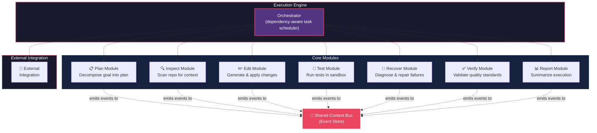
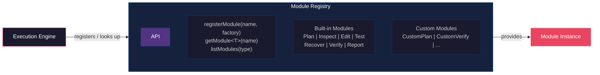
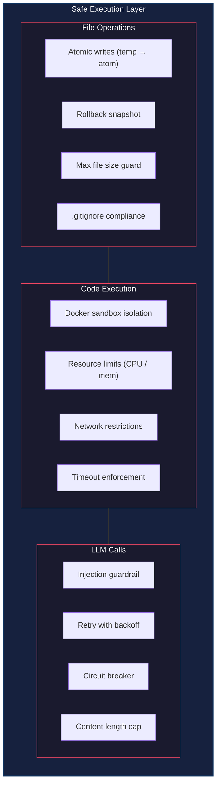
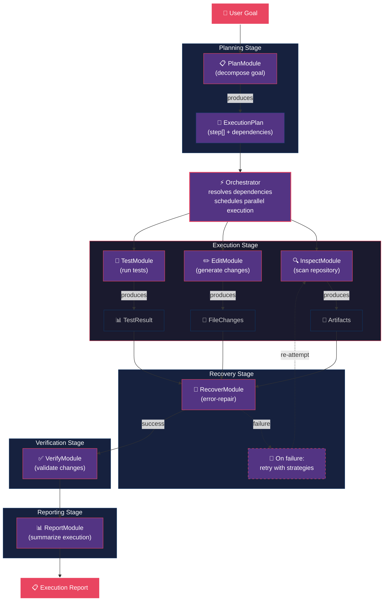
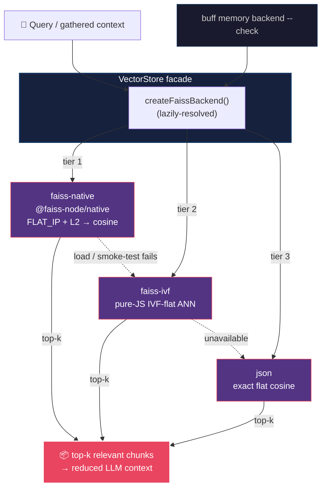

# Architecture Diagrams — Agent-Nuvira Execution Engine

Visual diagrams generated from [ARCHITECTURE.md](./ARCHITECTURE.md) using Mermaid. These render natively on GitHub and other Mermaid-compatible markdown viewers.

---

## 1. High-Level Module Architecture (ARCHITECTURE.md §2)



**Key insight:** The engine is not a linear pipeline — it's a dependency graph. Modules are scheduled by the orchestrator based on their declared dependencies, not by position in a list.

---

## 2. Extensibility System — Module Registry (ARCHITECTURE.md §4.1)



Any module can be replaced at the orchestrator level:
```typescript
const engine = new ExecutionEngine();
engine.modules.register('plan', new MyCustomPlanner());
```

---

## 3. Safe Execution Layer (ARCHITECTURE.md §4.3)



---

## 4. Data Flow — Full Execution Pipeline (ARCHITECTURE.md §4.4)



---

## 5. 17-Agent Registry (ARCHITECTURE.md §4.1)


Every agent is registered via `registry.register(name, factory, metadata)`;
plugins and SDK users can add or override agents with
`registerOrOverride`. The 17 built-ins wrap the engine modules (e.g. `writer`
→ EditModule, `tester` → TestModule, `debugger` → RecoverModule,
`reviewer` → VerifyModule).

---

## 6. Vector Store — FAISS-Backed Backend Tiers (ARCHITECTURE.md §4.5)



Priority order: `faiss-native` → `faiss-ivf` → `json` (same entry format,
zero migration). Overridable via `routing.vectorBackend` /
`BUFF_VECTOR_BACKEND`. Retrieval chunks (~512 tokens) → local embeddings
(`bge-small-en-v1.5`) → top-k reduction before the model call; any failure
fails over to full context.

---

## 7. Observability Bus — Event Flow (ARCHITECTURE.md §4.2)

```mermaid
flowchart LR
    subgraph Modules["Emitting Modules"]
        PlanEv["📋 Plan"]
        InsEv["🔍 Inspect"]
        EditEv["✏️ Edit"]
        TestEv["🧪 Test"]
        RecEv["🔧 Recover"]
        VerEv["✅ Verify"]
        RepEv["📊 Report"]
    end

    subgraph EventBus["📡 EventBus"]
        On["on(event, handler)"]
        Emit["emit(event, data)"]
        History["getHistory(filter)"]
    end

    subgraph Consumers["Built-in Consumers"]
        Logger["📝 LoggerConsumer\n→ console (--verbose)"]
        DAG["📊 DAGConsumer\n→ web dashboard"]
        Telemetry["📈 TelemetryConsumer\n→ performance metrics"]
        Debug["🐛 DebugConsumer\n→ full dump on failure"]
    end

    Modules -->|emit structured events| EventBus
    EventBus -->|dispatch to| Consumers

    style Modules fill:#16213e,stroke:#0f3460,color:#fff
    style EventBus fill:#e94560,stroke:#fff,color:#fff,stroke-width:2px
    style Consumers fill:#1a1a2e,stroke:#0f3460,color:#fff
```



This enables:
- **Real-time DAG visualization** in the web dashboard
- **Post-mortem debugging** from event history replay
- **Performance analytics** — slowest module, most retried step, etc.
- **CI/CD annotations** — structured output for GitHub Actions

---

## Color Legend

| Color | Element |
|---|---|
| 🟣 `#533483` | Modules / Active components |
| 🔵 `#16213e` | Stage / Subsystem containers |
| ⚫ `#1a1a2e` | Supporting components / Data objects |
| 🔴 `#e94560` | Central bus / User input / Output |
| ⚪ `#0f3460` | Container borders |

---

> Generated from [ARCHITECTURE.md](./ARCHITECTURE.md) §2, §4.1, §4.2, §4.3, §4.4, §4.5.
